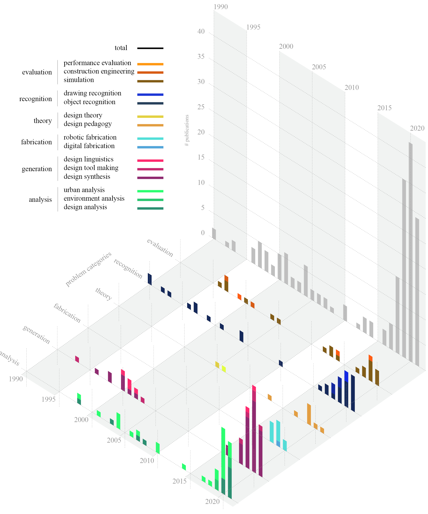

# Three-Decades-of-Machine-Learning-with-Neural-Networks-in-Computer-aided-Architectural-Design
This is a repository for the paper "Three Decades of Machine Learning with Neural Networks in Computer-aided Architectural Design (1990-2021)" in Design Science Journal

### Data
To collect the [raw data](https://github.com/leeuack/Three-Decades-of-Machine-Learning-with-Neural-Networks-in-Computer-aided-Architectural-Design/tree/main/raw_data) for the paper, we used a [scraper](https://github.com/leeuack/cumincadScraper). The scraper accessed all 16,182 publications in CumInCAD and extracted, research information such as research id, title, year, authors, source, abstract, references, etc. It then checked whether the information has at least one of the keywords. If the publication information includes a keyword, the full-text pdf, file, and its respective repository information as a csv file are saved. A total of 362 research papers and journal articles were collected.

We manually filtered out papers that are not closely related to deep learning. For this, each of the collected research papers was read and set tags that identify their statistical features. The tags are: validity, data, model, and content. Validity is binary valued: 0, if the publication does not include any learning process or only includes keywords in its references; and 1, otherwise. By this refinement, 175 of the original research papers and journal articles were excluded, and the remaining 187 publications were set as the final pool for statistical analysis.
All the valid papers can be found in the [all_data.csv](https://github.com/leeuack/Three-Decades-of-Machine-Learning-with-Neural-Networks-in-Computer-aided-Architectural-Design/blob/main/all_valid_papers.csv) file.

